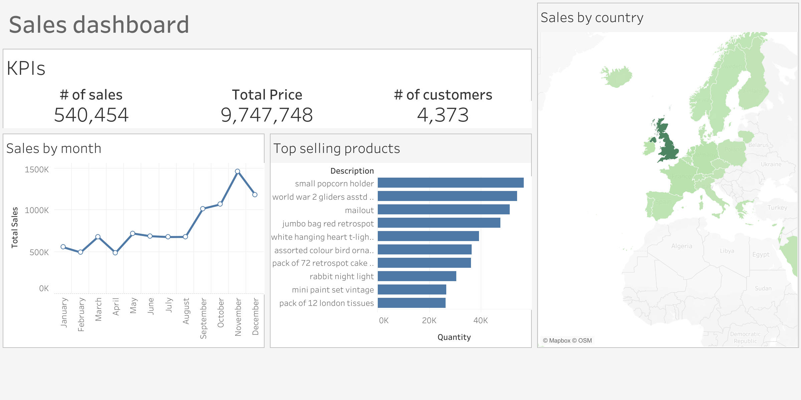

# Online Retail Sales Analysis

## Project Overview

This project analyzes sales data from a UK-based, registered non-store online retail company. The dataset covers all transactions between December 1, 2010 and December 9, 2011. The goal is to explore sales trends, product performance, and customer behavior using data cleaning, relational modeling, and visualization.

# Executive Summary
 
- November–December drive the highest revenue due to seasonal demand; February and April are the lowest-performing months.  
- The majority of revenue comes from the UK, with international markets contributing significantly less.  
- Repeat (known) customers make up the bulk of purchases, highlighting a loyal customer base.   
- Recommendations include optimizing promotions during peak hours, focusing on high-value products, enhancing customer retention, and expanding international presence strategically.  

## Business Problem

The company aimed to understand customer purchasing behavior and optimize revenue generation. Key questions included:

- Which products generate the most revenue and quantity sold?  
- When (time of day, day of week, and month) do sales peak or decline?  
- How does customer type (known vs unknown) affect revenue and repeat purchases?  
- Which international markets are underperforming and could be targeted for growth?  
- How can insights be leveraged to increase sales, retain customers, and improve operational efficiency?
## Dataset

The dataset contains transactional data including:

- Transaction identifiers (`InvoiceNo`, `StockCode`)  
- Product information (`Description`, `UnitPrice`)  
- Quantity sold (`Quantity`)  
- Transaction date and time (`InvoiceDate`)  
- Customer information (`CustomerID`, `Country`)  

The set was cleaned and transformed into the following model:  

## Project Goals

1. Data cleaning – handle missing values, normalize text, and prepare data for analysis  
2. Relational modeling – structure the data into fact and dimension tables for easier analysis  
3. Database loading – load the cleaned and structured data into PostgreSQL  
4. Analysis and dashboards – create dashboards to explore sales patterns, customer segments, and product performance  

## Tools & Technologies

- Python (Pandas) for data cleaning and preprocessing  
- PostgreSQL for data storage and relational modeling  
- Tableau for dashboarding  

## Key Performance Indicators

The following KPIs were defined:

- Total number of customers  
- Total revenue
- Total amount of sales  

## Graph Data Overview

The dashboard is presented below:

This analysis highlights key patterns, correlations, and trends in the sales data.

## Core Observations

- Top products  
  Small Popcorn Holder, World War 2 Gliders, and decorative items lead in quantity sold, suggesting strong demand for novelty and gift-oriented items.

- Monthly sales trends  
  Sales peak during November–December, likely driven by holiday demand, while February and April represent the lowest-performing months.

- Sales by country  
  The United Kingdom dominates overall revenue, with international markets contributing significantly less.

## Supporting Visual Insights

- Customer type distribution  
  The majority of sales come from known customers (approximately 4:1 ratio), indicating a strong and loyal customer base.

- Sales by day and hour  
  Peak sales occur between 12:00–16:00, with a noticeable surge around 14:00–15:00.  
  Tuesday and Thursday are the strongest weekdays, while Sunday shows the lowest activity.

- Highest revenue products  
  Dotcom Postage and Regency Cakestand 3 Tier generate the highest revenue, indicating that high-value items contribute disproportionately to profit.

## Key Insights

- Sales are highly time-dependent, with clear peaks during midday hours  
- Revenue is heavily concentrated in the UK market  
- A loyal customer base drives most purchases  
- Seasonality plays a major role, especially during the holiday period  
- High-value products, not just high-volume ones, are critical for profitability  

## Recommendations to Increase Revenue

### 1. Optimize Sales Timing
- Focus promotions, ads, and email campaigns during 12:00–16:00, especially Tuesday–Thursday  
- Schedule limited-time offers around 14:00–15:00 to maximize conversions  

### 2. Leverage Customer Data
- Convert unknown customers into registered users by offering:  
  - First-time discounts  
  - Loyalty points for account creation  
  - Simplified sign-up during checkout  
- Use purchase history to create personalized recommendations  

### 3. Strengthen Customer Retention
- Introduce or expand loyalty programs  
- Offer repeat purchase incentives such as discount codes or bundles  
- Send targeted email campaigns based on past behavior  

### 4. Focus on High-Value Products
- Promote high-revenue items more aggressively  
- Create bundles combining popular low-cost and high-margin products  
- Highlight premium products on the homepage  

### 5. Exploit Seasonal Trends
- Prepare inventory and marketing campaigns ahead of November–December  
- Introduce promotions or special events during low months such as February and April to stabilize revenue  

### 6. Expand International Presence
- Target promising markets such as Australia, Netherlands, and France with:  
  - Localized marketing campaigns  
  - Adjusted shipping options or pricing  
- Improve customer data collection to better understand international buyers  

### 7. Improve Operational Alignment
- Align staffing, inventory, and logistics with peak sales hours and periods  
- Ensure fast fulfillment for high-demand and high-value products  