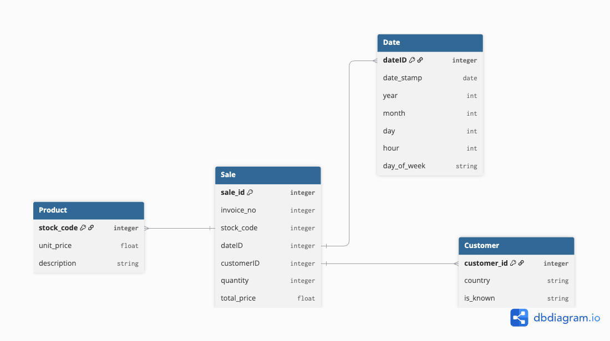

# Online Retail Sales Analysis

## Project Overview

This project analyzes sales data from a UK-based, registered non-store online retail company. The dataset covers all transactions between **December 1, 2010** and **December 9, 2011**. The goal is to explore sales trends, product performance, and customer behavior using data cleaning, relational modeling, and visualization.

## Dataset

The dataset contains transactional data including:

- Transaction identifiers (`InvoiceNo`, `StockCode`)  
- Product information (`Description`, `UnitPrice`)  
- Quantity sold (`Quantity`)  
- Transaction date and time (`InvoiceDate`)  
- Customer information (`CustomerID`, `Country`)  

The set was cleaned and transformed into the following model:

## Project Goals

1. **Data Cleaning** – handle missing values, normalize text, and prepare data for analysis.  
2. **Relational Modeling** – structure the data into fact and dimension tables for easier analysis.  
3. **Database Loading** – load the cleaned and structured data into PostgreSQL.  
4. **Analysis & Dashboards** – create dashboards to explore sales patterns, customer segments, and product performance.

## Tools & Technologies

- Python (Pandas) for data cleaning and preprocessing  
- PostgreSQL for data storage and relational modeling  
- Tableau  for dashboarding and reporting

## Status

Project is in progress: Process is currently on the stage of datavisualiztion
